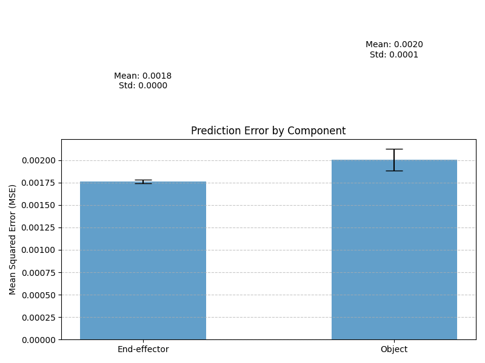

# cmpe_591hw4
Cmpe591_hw4
Results
After training the model, I evaluated it on 100 test cases with randomly generated context and target points. The evaluation measures the Mean Squared Error (MSE) for both end-effector and object position predictions.

The results are visualized in the mse_results.png file, which shows the mean and standard deviation of MSE for both components:

